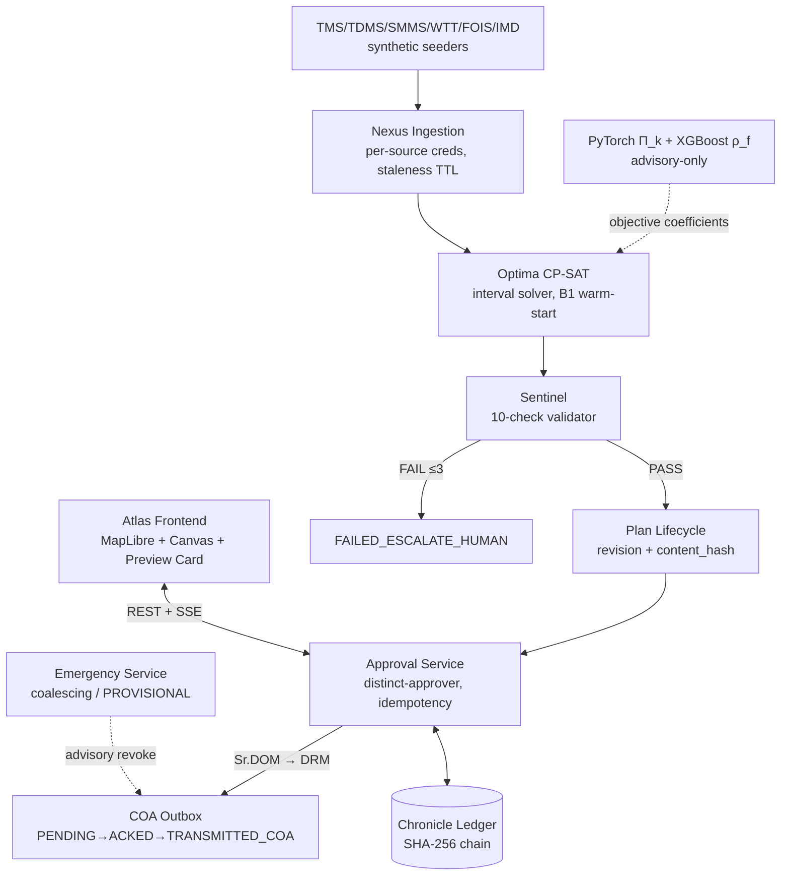

# RAIL-BLOC

> AI-powered, mathematically bounded block scheduling optimization platform for Indian Railways maintenance planning — unifying Civil, TRD, and Signal demands into safety-verified shadow blocks with two-tier human authorization before dispatch.


**[Quick Start](#getting-started)** · **[Documentation Index](#documentation-index)** · **[API Reference](#api-reference)** · **[Contributing](CONTRIBUTING.md)** · **[Operator Runbook](MANUAL_STEPS.md)** · **[Master Summary](docs/Summary.md)**

> ⚠️ **Safety & Simulation Notice:** This is a Smart India Hackathon prototype operating in a **fully simulated environment**. TMS, TDMS, SMMS, FOIS, COA and IMD are internal Indian Railways systems with no student-accessible API. All feeds are synthetic seeders with fixed seeds (42–44). Every synthetic UI layer carries a persistent `[SIMULATED]` watermark per `Rules.md` §5. No real credentials, operational data or live infrastructure is used anywhere.

---

## Table of Contents
- [About & Problem Statement](#about--problem-statement)
- [Key Features](#key-features)
- [System Architecture](#system-architecture)
- [Tech Stack](#tech-stack)
- [Project Directory Structure](#project-directory-structure)
- [Getting Started](#getting-started)
- [Usage & Execution](#usage--execution)
- [API Reference](#api-reference)
- [Testing & Quality Assurance](#testing--quality-assurance)
- [Security, Guardrails & Invariants](#security-guardrails--invariants)
- [Current Roadmap & Implementation Status](#current-roadmap--implementation-status)
- [Contributing & Development Guidelines](#contributing--development-guidelines)
- [Documentation Index](#documentation-index)
- [License](#license)

## About & Problem Statement
Indian Railways runs one of the world's most saturated networks, yet Civil, TRD and Signal departments still submit maintenance block demands independently through BDMS — producing piecemeal closures, idle machine fleets, freight detention and passenger delays. RAIL-BLOC unifies those demands into interval-based CP-SAT schedules bundled as cross-department shadow blocks, enforces G&SR safety rules via a deterministic 10-check Sentinel, and requires distinct Sr. DOM → DRM authorization before anything reaches COA. The governing principle throughout: **ML estimates; CP-SAT decides; Sentinel verifies; humans authorize; COA executes.**

## Key Features
- **Shadow Block Bundling** — Civil + TRD + S&T works co-allocated into single closure windows (window-containment reward in the CP-SAT objective).
- **10-Check Sentinel Validator** — deterministic G&SR/MILP checks (no network, no ML) with the enumerated list rendered on the approval card; counts are computed, never fabricated.
- **Content-Hash Binding (SAFE-002)** — SHA-256 `content_hash` sealed at Sentinel pass and re-verified at approve / authorize / transmit; drift → HTTP 409.
- **Distinct-Approver Enforcement (APP-001)** — `decided_by ≠ authorized_by` enforced by a DB CHECK constraint plus service-level 403.
- **Emergency PROVISIONAL Path (ADR-006)** — blast-radius modal → advisory revoke → corridor re-plan ≤45 s with synchronous structural checks → Controller acknowledgment gate.
- **Tamper-Evident Ledger (DB-001/DB-001b)** — `audit.append_event()` pre-statement advisory lock + INSERT-only role + guard triggers; rollback-gap-safe chain, live-verifiable at `/ledger/verify`.
- **Fail-Closed Telemetry (TEL-001/002)** — per-source machine credentials, staleness TTLs, plausibility contradictions, weather defers outdoor work when its feed is stale.
- **Interval CP-SAT (ADR-005)** — one `OptionalIntervalVar` per demand; NoOverlap against each headway-expanded train window; exogenous train paths; B1 warm-start (`AddHint`) so RAIL-BLOC never trails its baseline.
- **`[SIMULATED]` Honesty Architecture** — watermark + no unmeasured claims (Rules §5, R6.6); benchmark figures cite their harness runs.

## System Architecture

*Modular monolith (ADR-001): FastAPI + Redis workers. No microservices, no blockchain, no RL.*

## Tech Stack

| Layer | Technology | Version |
|---|---|---|
| Frontend | Next.js 13 (app router, static export) + TypeScript(strict) + Tailwind + Radix UI + MapLibre GL JS | 13.5 / React 18.2 / MapLibre 6.6+ |
| Backend | FastAPI + Pydantic v2 + SQLAlchemy 2.0 async (asyncpg) | 0.111+ on Python 3.11 |
| Solver | Google OR-Tools CP-SAT (OptionalIntervalVar, NoOverlap) | 9.9+ |
| ML (advisory-only) | PyTorch (Π_k) + XGBoost (ρ_f) | 2.3+ / 2.0+ |
| Database | PostgreSQL + PostGIS + pgcrypto + btree_gist | 16 / 3.4 |
| Queue & Workers | Redis + Celery (+ beat) | 7.2+ / 5.3+ |
| Containers | Docker Engine + Compose v2 | ≥ 26 |

## Project Directory Structure
```text
rail-bloc/
├── docker-compose.yml          # postgres · redis · seeder · api · worker · beat · web
├── .env.example                # every knob documented; 2 secrets you generate
├── apps/
│   ├── api/                    # FastAPI gateway: routers, services, schemas, core
│   ├── web/                    # Atlas console (Next.js 13 app-router + TS strict + static export)
│   ├── workers/                # Celery solve pipeline + beat cadences + feed sims
│   └── eval/                   # fixed-seed benchmark harness + ML calibration
├── packages/
│   ├── core/                   # shared frozen models
│   ├── optima/                 # CP-SAT formulation, heuristic(B1), VRP, objectives
│   ├── sentinel/               # the 10 enumerated checks (rules.py + validator.py)
│   ├── chronicle/              # canonical content_hash + REPEATABLE READ verifier
│   └── ml/                     # advisory PyTorch urgency + XGBoost forecaster
├── data/
│   ├── sql/                    # 01_init_postgis · 02_schema_ddl · 03_ledger_triggers
│   └── generators/             # corridor/demand/traffic generators + idempotent seed_all
├── docs/                       # the 8 canonical specs + Summary.md
├── tests/                      # unit + integration suites (live-container capable)
├── scripts/                    # ledger stress tools
└── MANUAL_STEPS.md             # operator runbook (this repo's ops bible)
```

## Getting Started

### Prerequisites
| Requirement | Minimum | Verify |
|---|---|---|
| Docker Desktop | ≥ 4.30 (Engine ≥ 26) | `docker --version` |
| Docker Compose | v2 | `docker compose version` |
| Git | ≥ 2.40 | `git --version` |
| Python 3.11 *(optional)* | for local pytest/eval | `python --version` |
| Node 20 *(optional)* | for local frontend dev | `node --version` |

Hardware: ≥8 GB RAM (16 rec.), ≥4 cores, ≥15 GB disk. First build pulls CPU-PyTorch (~10–25 min).

### Installation
```bash
git clone https://github.com/<your-username>/rail-bloc.git
cd rail-bloc

cp .env.example .env
# Generate two secrets:
openssl rand -hex 32   # → JWT_SECRET
openssl rand -hex 16   # → POSTGRES_PASSWORD (hex only — it lives inside DSNs)
# then update DATABASE_URL and DATABASE_URL_SYNC to match the new password

docker compose up --build      # single command; seeder runs once, then services start
```

Verify:
```bash
curl http://localhost:8000/health        # {"status":"ok","db":true,...}
docker compose logs seeder | tail -1     # Seeded: 12 sections, 286 demands, 276 paths.
open http://localhost:5173               # Atlas console ([SIMULATED] watermark visible)
```

### Environment Variables
Full annotated table lives in [`MANUAL_STEPS.md §3`](MANUAL_STEPS.md). Headlines:

| Group | Variables | Notes |
|---|---|---|
| Infrastructure | `POSTGRES_*`, `DATABASE_URL`, `DATABASE_URL_SYNC`, `REDIS_URL`, `API_PORT` | password must be hex; keep DSNs consistent |
| Auth (generate!) | `JWT_SECRET` (hex32), `SEED_PASSWORD`, `JWT_ALGORITHM=HS256`, `ACCESS_TOKEN_EXPIRE_MINUTES=480` | defaults are demo-grade — rotate before network demos |
| Solver | `SOLVER_MAX_TIME_SECONDS=35` (NFR-001), `SOLVER_NUM_WORKERS=8`, `OBJECTIVE_WEIGHT_{PAX_DELAY,FRT_DELAY,SHADOW_REWARD,MACHINE_IDLE,UNADDRESSED_DEFECT,EARLY_START}` | zero-hardcoding policy (Rules §4) |
| Safety | `HEADWAY_HIGH_PRIORITY_MINS=15`, `HEADWAY_DEFAULT_MINS=5`, `FREIGHT_HARD_CONFIDENCE=0.60`, `EMERGENCY_SOLVE_BUDGET_SECONDS=35`, `MAX_SENTINEL_RETRIES=3`, `DEMAND_STALENESS_TTL_HOURS=12`, `WEATHER_STALENESS_TTL_HOURS=3` | fail-closed knobs |
| Cadence | `WEEKLY_PLAN_CRON=0 15 * * 4` | XC-010: cadence is config, not code |
| External keys (all mock) | `INGEST_KEY_{TMS,TDMS,SMMS,FOIS}`, `FOIS_FEED_SECRET`, `COA_BRIDGE_SECRET`, `IMD_API_KEY` | no real credentials exist or are required |
| Toggles | `ENABLE_ML_URGENCY=true` | ML stays advisory |

## Usage & Execution

### Service Ports
| Service | Port | URL |
|---|---|---|
| Atlas Frontend (nginx) | 5173 | http://localhost:5173 |
| FastAPI Backend | 8000 | http://localhost:8000/docs |
| PostgreSQL 16+PostGIS | 5432 | internal (`localhost` published) |
| Redis 7.2 | 6379 | internal (`localhost` published) |

### Demo Credentials (auto-seeded; password = SEED_PASSWORD, default `railbloc`)
`srdom_dli`(SR_DOM) · `drm_dli`(DRM) · `controller_dli`(CONTROLLER) · `engineer_dli`(ENGINEER) · `sm_dli`(STATION_MASTER) · `auditor`(AUDITOR) · `admin`(ADMIN)

### Quick Verification
```bash
TOKEN=$(curl -s -X POST localhost:8000/api/v1/auth/login -H "Content-Type: application/json" \
        -d '{"username":"srdom_dli","password":"railbloc"}' | jq -r .access_token)

curl -s -X POST localhost:8000/api/v1/optimize/solve -H "Authorization: Bearer $TOKEN" \
     -H "Content-Type: application/json" -d '{"horizon":"WEEKLY","division":"DLI"}'
# → 202 {"task_id":"...","status":"QUEUED"}  then poll /optimize/status/{task_id}

curl -s localhost:8000/api/v1/ledger/verify -H "Authorization: Bearer $AUDITOR_TOKEN"
# → {"chain_ok":true,...,"verdict":"tamper-EVIDENT chain intact"}
```

## API Reference
All routes are prefixed `/api/v1`. RBAC = minimum role(s); division-scoped object access applies beyond role.

| Method | Route | Description | Auth / RBAC |
|---|---|---|---|
| POST | `/auth/login` | JWT login (HS256) | public |
| GET | `/auth/me` | current actor claims | any bearer |
| POST | `/demands/ingest` | bulk machine-feed ingestion (TMS/TDMS/SMMS) w/ TTL+plausibility+upsert | per-source key headers (`X-Source-System`,`X-Source-Key`) |
| GET | `/demands` | list/filter demands | any bearer; division-scoped |
| POST | `/demands/manual` | BDMS_MANUAL single upload | ENGINEER/ADMIN |
| POST | `/optimize/solve` | queue horizon solve (per-division lock) | SR_DOM/ADMIN |
| GET | `/optimize/status/{task_id}` | solver run state + stats | ops roles (incl AUDITOR) |
| GET | `/plans` | list plans (horizon/division/status filters) | any bearer; division-scoped |
| GET | `/plans/weekly` | weekly schedule feed | any bearer; division-scoped |
| GET | `/plans/geo` | GeoJSON sections/blocks/OHE layers | any bearer |
| GET | `/plans/timetable` | train paths for string chart/map | any bearer |
| GET | `/plans/summary` | KPI summary + escalated-overdue + fleet utilization | any bearer |
| GET | `/plans/{id}` | plan bundle (demands, acks, roster) | any bearer; division check |
| GET | `/plans/{id}/sentinel-report` | live re-run of the 10 checks | any bearer |
| POST | `/plans/{id}/acknowledge-signal` | G&SR-2 SM/Controller ack | STATION_MASTER/CONTROLLER/ADMIN |
| POST | `/plans/{id}/revise` | create revision+1 at DRAFT (SAFE-002) | SR_DOM/ENGINEER/ADMIN |
| POST | `/plans/{id}/transmit` | T−2h structural re-check → outbox enqueue | SR_DOM/CONTROLLER/ADMIN |
| POST | `/plans/{id}/activate` | block start (line isolated) | CONTROLLER/ADMIN |
| POST | `/plans/{id}/complete-fitness` | SSE fitness certification | ENGINEER/STATION_MASTER/CONTROLLER/ADMIN |
| POST | `/plans/{id}/archive` | seal to ARCHIVED_SEALED | ADMIN/AUDITOR |
| POST | `/plans/{id}/cancel` | cancel pre-transmission plan | SR_DOM/DRM/ADMIN |
| POST | `/approvals/decide` | approve/reject/authorize w/ hash gate + idempotency | SR_DOM/DRM |
| GET | `/emergency/blast-radius` | trains held, plans superseded, adjacent sections | CONTROLLER/SR_DOM/DRM/ENGINEER/ADMIN |
| POST | `/emergency/breakdown` | P0 incident + advisory revoke + PROVISIONAL replan | CONTROLLER (confirmation + idempotency required) |
| GET | `/emergency/incidents` | incident feed incl. coalescing links | any bearer |
| POST | `/emergency/incidents/{id}/acknowledge` | Controller-ack gate for PROVISIONAL | CONTROLLER |
| GET | `/ledger/verify` | full chain re-hash (REPEATABLE READ) | AUDITOR/ADMIN |
| GET | `/ledger/entries` | ledger explorer feed | AUDITOR/ADMIN |
| GET | `/stream/live-blocks` | SSE live events (?token= auth, heartbeats) | any bearer via query token |
| GET | `/weather/alerts` | IMD-mock alerts ∩ sections + staleness flag | any bearer |
| GET | `/weather/deferred-activities` | fail-closed deferred work types | any bearer |
| POST | `/operations/timetable/upload` | WTT rows upsert (DB-006 key) | ADMIN/ENGINEER |
| POST | `/operations/feeds/wtt-poll` | machine-credential poll endpoint | source key headers |
| GET | `/health` | liveness + db probe | public |

## Testing & Quality Assurance
```bash
# Full backend suite (unit + integration). Integration needs live PG/Redis:
pytest -q                                   # host, with DATABASE_URL_SYNC set
docker compose exec api pytest -q           # in-container equivalent

# Targeted suites
pytest tests/unit -q                        # sentinel properties, solver optimum/corridor, hashing
pytest tests/integration/test_faults.py -q  # fault-injection (solver/sentinel/PG-kill/Redis-down)
python scripts/ledger_stress_raw.py         # concurrent-writer ledger stress → chain_ok=true

# Frontend (strict TS included in build)
cd apps/web && npm install && npm run build

# Benchmark + calibration (measured outputs; label results as simulated-scenario data)
PYTHONPATH=. python -m apps.eval.benchmark --weeks 1
PYTHONPATH=. python -m apps.eval.calibrate

# Ledger tamper proof (expected ERROR — append-only guard):
docker compose exec postgres psql -U rail_admin -d railbloc_db \
  -c "UPDATE audit.action_ledger SET hash='tampered' WHERE seq=1;"
# ERROR: audit.action_ledger is append-only: UPDATE is prohibited on sealed ledger rows
```

## Security, Guardrails & Invariants
* **G&SR-1..5** (block exclusion · interlocking acks · fail-closed telemetry · OHE isolation boundaries · headway margins) — each has a named enforcement point listed in `Rules.md §1`.
* **NFR-007/NFR-008** — content_hash == sentinel_hash at transmission; decided_by ≠ authorized_by at DB level.
* **Idempotency keys** mandatory on `/approvals/decide` and `/emergency/breakdown`.
* **Ledger** — advisory-locked `append_event()`, INSERT-only role, UPDATE/DELETE guards; *tamper-evident*, not tamper-proof.
* **Demo honesty** — `[SIMULATED]` watermark, fixed seeds, live solver only, computed check counts, no unmeasured claims (Rules §5 / R6.6).
* Authoritative text: [`docs/Rules.md`](docs/Rules.md).

## Current Roadmap & Implementation Status
Implemented and **verified** (evidence: `Tracker.md §4`): DDL+triggers (incl. post-build ledger concurrency fix DB-001b) · generators/seeder · interval CP-SAT solver · Sentinel 10-check module · Plan Lifecycle · Approval Service · Emergency Service · COA outbox bridge · Atlas console (Next.js, typecheck + vitest green) · fixed-seed benchmark harness (measured cell recorded) · ML calibration (ECE 0.0331) · **full Docker Compose stack booted end-to-end (all services healthy, migrate+seed+API+worker+beat+web) · broker-driven solve completed (CP-SAT OPTIMAL, plan + rosters + ledger event persisted, 8.2 s wall) · 76 automated tests green against live PostgreSQL 16 + PostGIS + Redis 7.2 (also enforced in CI on every PR)**.

Open verifications (honest `[ ]`/`[/]` in Tracker): browser FPS profiling · frontend runtime smoke is covered by the vitest suite, deeper interaction coverage lands with the Atlas redesign in progress.

Representative checklist:
- [x] DDL + triggers (pgcrypto-first, 12+PROVISIONAL states, advisory-locked ledger, guards)
- [x] CP-SAT interval reformulation (OptionalIntervalVar, per-train NoOverlap, B1 hint)
- [x] Sentinel 10-check module + OHE boundary + signal-ack gating
- [x] Plan Lifecycle Service (revision/content_hash binding; 409 on modify-after-verify)
- [x] Approval Service (distinct approver, idempotency, division scope)
- [x] Emergency Service (coalescing, PROVISIONAL, Controller ack)
- [x] Benchmark harness (fixed seeds, documented B1 tuning) — measured cell recorded
- [ ] First full-stack containerized boot + broker-driven solve drill
- [ ] Fault-injection clean rerun + browser FPS profiling

*Benchmark figures quoted anywhere are simulated-scenario measurements from the cited harness run — Design Targets until more cells accumulate. See `Tracker.md` for granular evidence.*

## Contributing & Development Guidelines
Read **[CONTRIBUTING.md](CONTRIBUTING.md)** for setup, branch naming (`feat/sentinel-…`), Conventional Commits with RAIL-BLOC scopes, and PR review. **Safety-critical changes** (Sentinel rules, solver constraints, ledger SQL, approval/emergency gates, canonical hash) require the `SAFETY-CRITICAL` label and two sign-offs including one Safety Reviewer — see the [policy](CONTRIBUTING.md#safety-critical-change-policy). Code of Conduct lives there too.

## Documentation Index
1. [`docs/PRD.md`](docs/PRD.md) — FR-001–FR-030, NFRs, personas
2. [`docs/TechSpec.md`](docs/TechSpec.md) — reformulated model §2, ADR-001–006, hardened API contract
3. [`docs/AppFlow.md`](docs/AppFlow.md) — sitemap, FSMs, Scenarios A–C
4. [`docs/Design.md`](docs/Design.md) — tokens, string chart, Action Preview Card, overlays
5. [`docs/Schema.md`](docs/Schema.md) — DDL, roles, triggers, EXCLUDE, change-log (incl. DB-001b)
6. [`docs/ImplementationPlan.md`](docs/ImplementationPlan.md) — TASK-001…060 DAG
7. [`docs/Tracker.md`](docs/Tracker.md) — honest matrix + §4 Evidence Log
8. [`docs/Rules.md`](docs/Rules.md) — non-negotiable safety/honesty rules
9. [`docs/Summary.md`](docs/Summary.md) — master executive summary
10. [`MANUAL_STEPS.md`](MANUAL_STEPS.md) — operator runbook · [`CONTRIBUTING.md`](CONTRIBUTING.md) — dev guide

## License
Distributed under the [Apache License 2.0](LICENSE).
