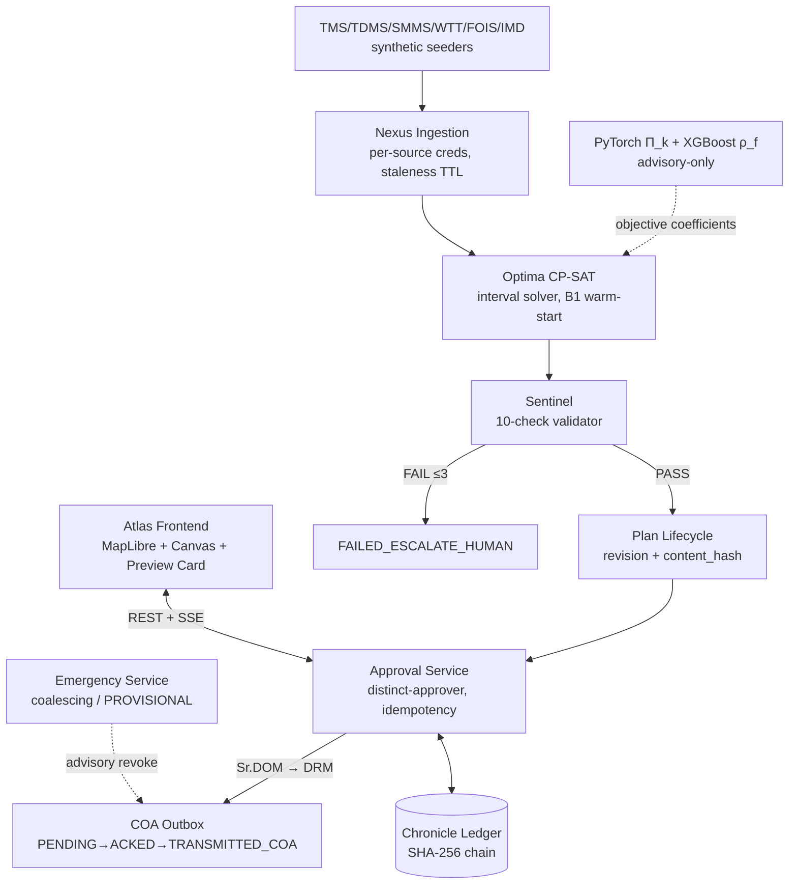
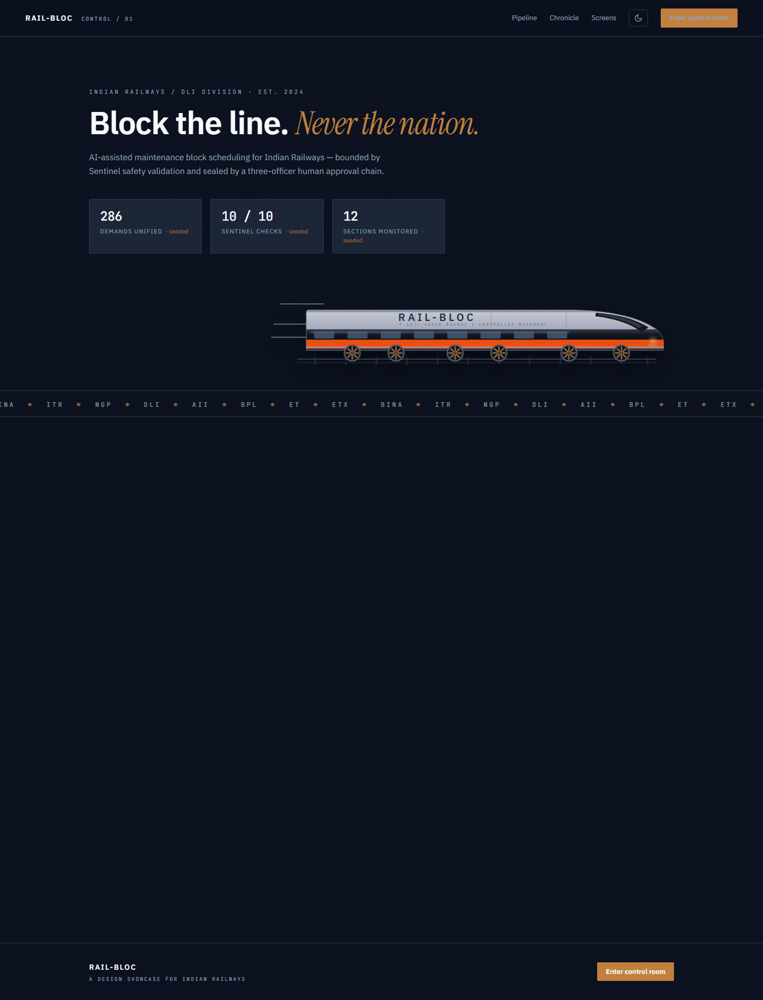
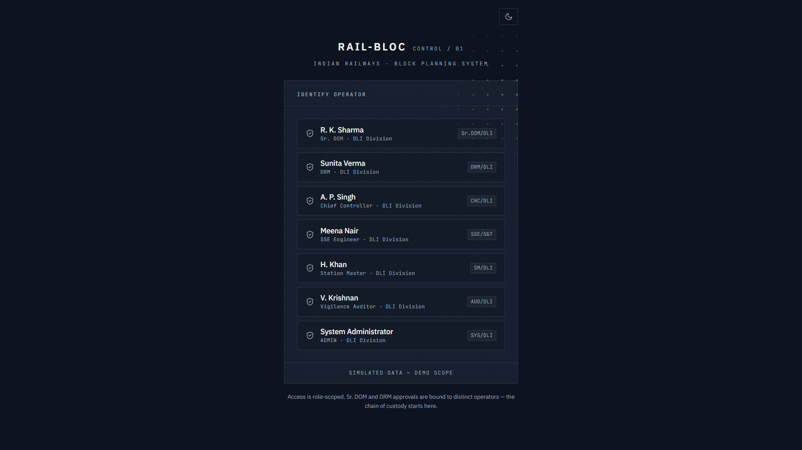
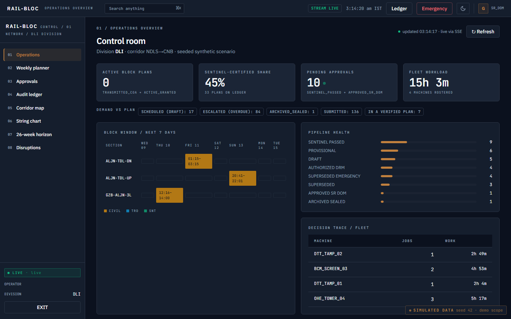
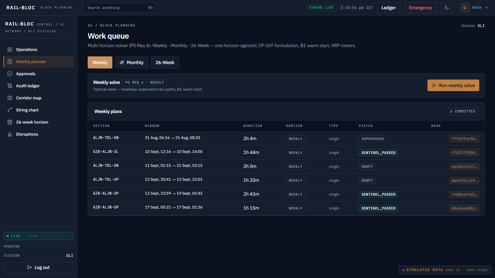
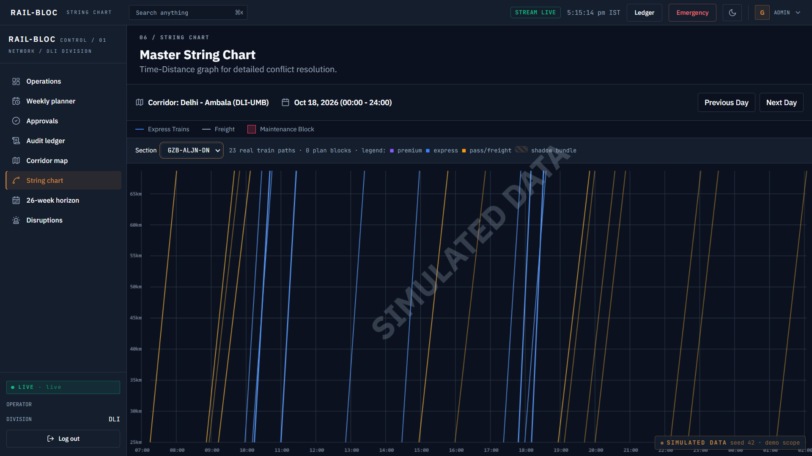
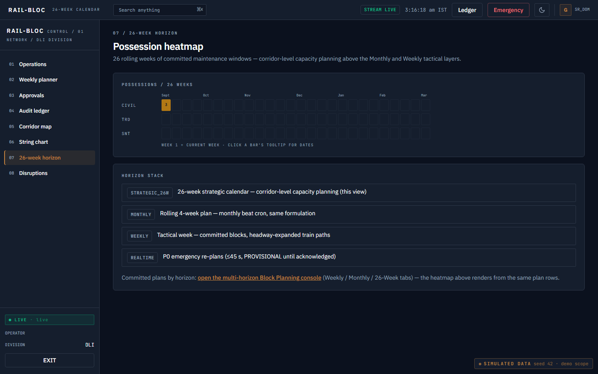
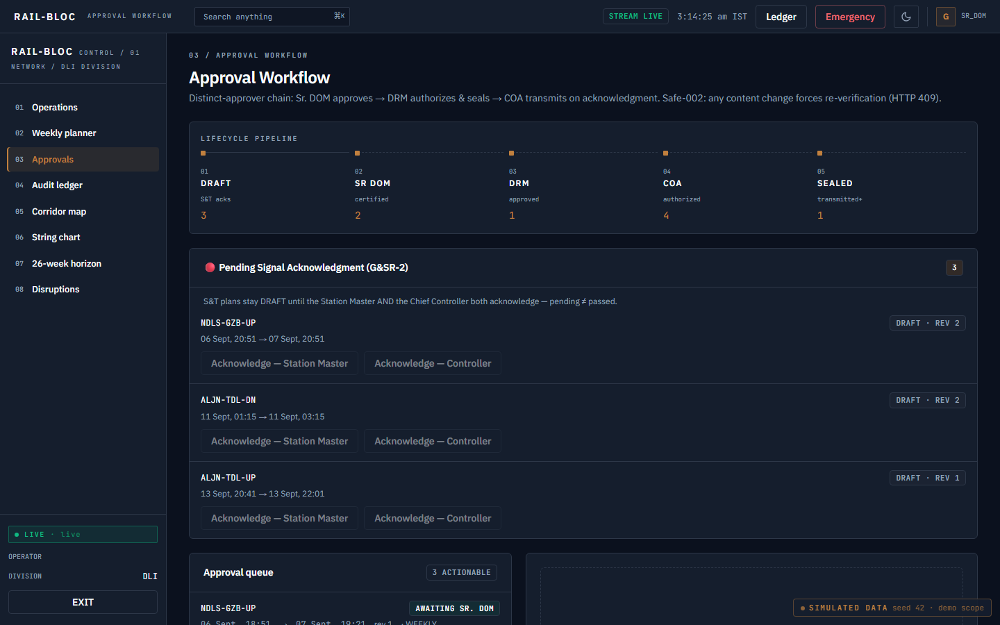
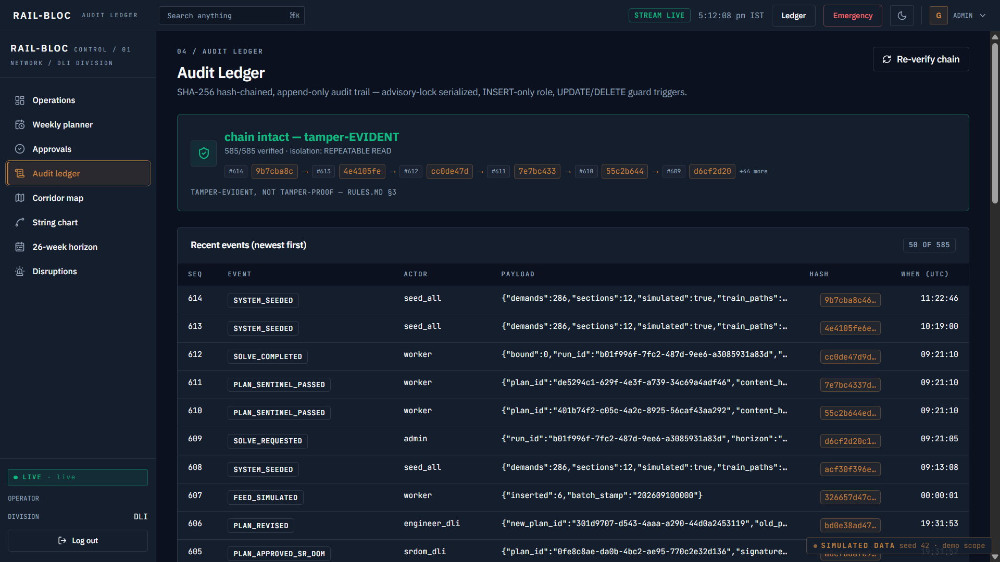
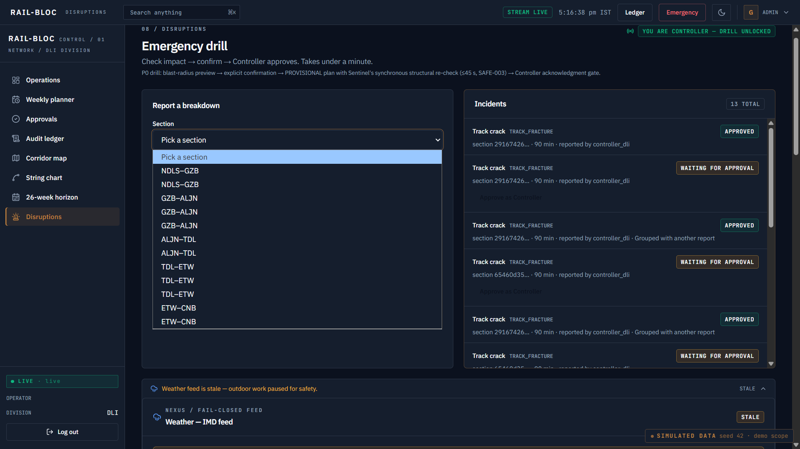

# RAIL-BLOC


> AI-powered, mathematically bounded block scheduling optimization platform for Indian Railways maintenance planning — unifying Civil, TRD, and Signal demands into safety-verified shadow blocks with two-tier human authorization before dispatch.


**[🎥 Demo Video](https://youtu.be/JATyKKmkJBI)** · **[Pitch Deck — Drive](https://drive.google.com/file/d/1qfgUEQA6ZH0lPdPvUzN7G3Nw-ggC9uNH/view)** · **[Pitch Deck — Dropbox](https://www.dropbox.com/scl/fi/bwvbh2e9r8q3r20hlyzbr/Insomnia_SIH2026_Presentation.pptx?rlkey=mgfx2flirivrgjbz7fhjqxbyf&st=yz7atabh&dl=0)**

**[Quick Start](#getting-started)** · **[Documentation Index](#documentation-index)** · **[API Reference](#api-reference)** · **[Contributing](CONTRIBUTING.md)** · **[Operator Runbook](MANUAL_STEPS.md)** · **[Master Summary](docs/Summary.md)**

> ⚠️ **Safety & Simulation Notice:** This is a Smart India Hackathon prototype operating in a **fully simulated environment**. TMS, TDMS, SMMS, FOIS, COA and IMD are internal Indian Railways systems with no student-accessible API. All feeds are synthetic seeders with fixed seeds (42–44). Every synthetic UI layer carries a persistent `[SIMULATED]` watermark per `Rules.md` §5. No real credentials, operational data or live infrastructure is used anywhere.

---

## Project Information

- **Project Title:** RAIL-BLOC
- **PS ID:** SIH26027
- **PS Title:** AI-Powered Automatic Block Planning to Maximize Asset Availability for Train Operations on Indian Railways
- **Organization / Department:** Ministry of Railways
- **Category:** Software
- **Theme:** Transportation & Logistics
- **Demo Video:** [youtu.be/JATyKKmkJBI](https://youtu.be/JATyKKmkJBI)
- **Pitch Deck:** [Google Drive](https://drive.google.com/file/d/1qfgUEQA6ZH0lPdPvUzN7G3Nw-ggC9uNH/view) · [Dropbox](https://www.dropbox.com/scl/fi/bwvbh2e9r8q3r20hlyzbr/Insomnia_SIH2026_Presentation.pptx?rlkey=mgfx2flirivrgjbz7fhjqxbyf&st=yz7atabh&dl=0)
- **Live Prototype:** [railbloc.vercel.app](https://railbloc.vercel.app)

---

## Team

| Member  | Role                                        |
| ------- | ------------------------------------------- |
| Abhinav | Full-stack & Solver Integration             |
| Bharat  | Backend & Data Engineering                  |
| Tijil   | Frontend & UI/UX                            |
| Priyam  | ML & Forecasting                            |
| Sneha   | Safety Checks & Documentation               |
| Kanika  | Testing & QA                                |

_(Roles are indicative of primary contribution areas — the team is cross-functional.)_

---

## Table of Contents

- [Project Information](#project-information)
- [Team](#team)
- [About & Problem Statement](#about--problem-statement)
- [Proposed Solution](#proposed-solution)
- [Key Features](#key-features)
- [System Architecture](#system-architecture)
- [Tech Stack](#tech-stack)
- [Project Directory Structure](#project-directory-structure)
- [Getting Started](#getting-started)
- [Usage & Execution](#usage--execution)
- [API Reference](#api-reference)
- [Testing & Quality Assurance](#testing--quality-assurance)
- [Security, Guardrails & Invariants](#security-guardrails--invariants)
- [Current Roadmap & Implementation Status](#current-roadmap--implementation-status)
- [Future Scope](#future-scope)
- [Screenshots](#screenshots)
- [Contributing & Development Guidelines](#contributing--development-guidelines)
- [Documentation Index](#documentation-index)
- [License](#license)

## About & Problem Statement

Indian Railways runs one of the world's most saturated networks, yet Civil, TRD and Signal departments still submit maintenance block demands independently through BDMS — producing piecemeal closures, idle machine fleets, freight detention and passenger delays. RAIL-BLOC unifies those demands into interval-based CP-SAT schedules bundled as cross-department shadow blocks, enforces G&SR safety rules via a deterministic 10-check Sentinel, and requires distinct Sr. DOM → DRM authorization before anything reaches COA. The governing principle throughout: **ML estimates; CP-SAT decides; Sentinel verifies; humans authorize; COA executes.**

## Proposed Solution

RAIL-BLOC is an AI-assisted, constraint-verified block planning system built on one governing principle — **the solver never vouches for itself.** Five cooperating stages form a single auditable pipeline (a modular monolith, ADR-001 — no microservices, no blockchain, no RL):

1. **Nexus — ingestion (fail-closed).** TMS/TDMS/SMMS/WTT/FOIS/IMD demands arrive behind per-source machine credentials; staleness TTLs and plausibility contradictions reject bad data with diagnostics instead of guessing.
2. **Optima — optimization.** One interval-based CP-SAT formulation (ADR-005) schedules all departments' demands jointly, bundling Civil + TRD + S&T works into shared closure windows ("shadow blocks"). ML degradation and freight models only tune objective coefficients — advisory input never decides feasibility.
3. **Sentinel — independent verification.** Ten deterministic checks (G&SR-1…5, MILP-C1…C5), computed without any network or ML dependency, re-derive constraints from source data; a plan is valid only while its sealed `content_hash` still matches.
4. **Plan Lifecycle — human authorization.** A hash-bound approval chain in which two distinct humans sign in sequence — Sr. DOM approves, DRM authorizes (enforced by a DB constraint, never the same account twice) — and COA transmission happens only on acknowledgment.
5. **Chronicle — evidence.** Every event appends to a SHA-256 hash-chained ledger inside PostgreSQL: INSERT-only, guard-triggered, rollback-gap-safe, and live-verifiable at `/ledger/verify`.

The Atlas console wraps this pipeline in a role-scoped control room — corridor map, string chart, approvals desk, emergency drill and audit view, each persona seeing exactly its own responsibilities. The result for the same corridor that today suffers piecemeal closures: fewer window closures per unit of maintenance, less work-on-work interference, a machine-checked safety verdict before any human signature, and a tamper-evident trail behind every decision.

## Key Features

- **Shadow Block Bundling** — Civil + TRD + S&T works co-allocated into single closure windows (window-containment reward in the CP-SAT objective).
- **10-Check Sentinel Validator** — deterministic G&SR/MILP checks (no network, no ML) with the enumerated list rendered on the approval card; counts are computed, never fabricated.
- **Content-Hash Binding (SAFE-002)** — SHA-256 `content_hash` sealed at Sentinel pass and re-verified at approve / authorize / transmit; drift → HTTP 409.
- **Distinct-Approver Enforcement (APP-001)** — `decided_by ≠ authorized_by` enforced by a DB CHECK constraint plus service-level 403.
- **Emergency PROVISIONAL Path (ADR-006)** — blast-radius modal → advisory revoke → corridor re-plan ≤45 s with synchronous structural checks → Controller acknowledgment gate.
- **Tamper-Evident Ledger (DB-001/DB-001b)** — `audit.append_event()` pre-statement advisory lock + INSERT-only role + guard triggers; rollback-gap-safe chain, live-verifiable at `/ledger/verify`.
- **Fail-Closed Telemetry (TEL-001/002)** — per-source machine credentials, staleness TTLs, plausibility contradictions, weather defers outdoor work when its feed is stale.
- **Interval CP-SAT (ADR-005)** — one `OptionalIntervalVar` per demand; NoOverlap against each headway-expanded train window; exogenous train paths; B1 warm-start (`AddHint`) so RAIL-BLOC never trails its baseline.
- **`[SIMULATED]` Honesty Architecture** — watermark + no unmeasured claims (Rules §5, R6.6); benchmark figures cite their harness runs.

## System Architecture



_Modular monolith (ADR-001): FastAPI + Redis workers. No microservices, no blockchain, no RL._

## Tech Stack

| Layer              | Technology                                                                                         | Version                           |
| ------------------ | -------------------------------------------------------------------------------------------------- | --------------------------------- |
| Frontend           | Next.js 13 (app router, static export) + TypeScript(strict) + Tailwind + Radix UI + MapLibre GL JS | 13.5 / React 18.2 / MapLibre 6.6+ |
| Backend            | FastAPI + Pydantic v2 + SQLAlchemy 2.0 async (asyncpg)                                             | 0.111+ on Python 3.11             |
| Solver             | Google OR-Tools CP-SAT (OptionalIntervalVar, NoOverlap)                                            | 9.9+                              |
| ML (advisory-only) | PyTorch (Π_k) + XGBoost (ρ_f)                                                                      | 2.3+ / 2.0+                       |
| Database           | PostgreSQL + PostGIS + pgcrypto + btree_gist                                                       | 16 / 3.4                          |
| Queue & Workers    | Redis + Celery (+ beat)                                                                            | 7.2+ / 5.3+                       |
| Containers         | Docker Engine + Compose v2                                                                         | ≥ 26                              |

## Project Directory Structure

```text
rail-bloc/
├── docker-compose.yml          # postgres · redis · seeder · api · worker · beat · web
├── .env.example                # every knob documented; 2 secrets you generate
├── apps/
│   ├── api/                    # FastAPI gateway: routers, services, schemas, core
│   ├── web/                    # Atlas console (Next.js 13 app-router + TS strict + static export)
│   ├── workers/                # Celery solve pipeline + beat cadences + feed sims
│   └── eval/                   # fixed-seed benchmark harness + ML calibration
├── packages/
│   ├── core/                   # shared frozen models
│   ├── optima/                 # CP-SAT formulation, heuristic(B1), VRP, objectives
│   ├── sentinel/               # the 10 enumerated checks (rules.py + validator.py)
│   ├── chronicle/              # canonical content_hash + REPEATABLE READ verifier
│   └── ml/                     # advisory PyTorch urgency + XGBoost forecaster
├── data/
│   ├── sql/                    # 01_init_postgis · 02_schema_ddl · 03_ledger_triggers
│   └── generators/             # corridor/demand/traffic generators + idempotent seed_all
├── docs/                       # the 8 canonical specs + Summary.md
├── assets/screenshots/         # submission screenshots (redesigned UI)
├── submission/                 # PRESENTATION.md + DEMO.md (SIH submission artifacts)
├── tests/                      # unit + integration suites (live-container capable)
├── scripts/                    # ledger stress tools
├── SUBMISSION_GUIDE.md         # SIH submission checklist (adapted from NSUT-SIH-26 template)
└── MANUAL_STEPS.md             # operator runbook (this repo's ops bible)
```

## Getting Started

### Prerequisites

| Requirement              | Minimum                | Verify                   |
| ------------------------ | ---------------------- | ------------------------ |
| Docker Desktop           | ≥ 4.30 (Engine ≥ 26)   | `docker --version`       |
| Docker Compose           | v2                     | `docker compose version` |
| Git                      | ≥ 2.40                 | `git --version`          |
| Python 3.11 _(optional)_ | for local pytest/eval  | `python --version`       |
| Node 20 _(optional)_     | for local frontend dev | `node --version`         |

Hardware: ≥8 GB RAM (16 rec.), ≥4 cores, ≥15 GB disk. First build pulls CPU-PyTorch (~10–25 min).

### Installation

```bash
git clone https://github.com/<your-username>/rail-bloc.git
cd rail-bloc

cp .env.example .env
# Generate two secrets:
openssl rand -hex 32   # → JWT_SECRET
openssl rand -hex 16   # → POSTGRES_PASSWORD (hex only — it lives inside DSNs)
# then update DATABASE_URL and DATABASE_URL_SYNC to match the new password

docker compose up --build      # single command; seeder runs once, then services start
```

Verify:

```bash
curl http://localhost:8000/health        # {"status":"ok","db":true,...}
docker compose logs seeder | tail -1     # Seeded: 12 sections, 286 demands, 276 paths.
open http://localhost:5173               # Atlas console ([SIMULATED] watermark visible)
```

### Environment Variables

Full annotated table lives in [`MANUAL_STEPS.md §3`](MANUAL_STEPS.md). Headlines:

| Group                    | Variables                                                                                                                                                                                                                  | Notes                                                 |
| ------------------------ | -------------------------------------------------------------------------------------------------------------------------------------------------------------------------------------------------------------------------- | ----------------------------------------------------- |
| Infrastructure           | `POSTGRES_*`, `DATABASE_URL`, `DATABASE_URL_SYNC`, `REDIS_URL`, `API_PORT`                                                                                                                                                 | password must be hex; keep DSNs consistent            |
| Auth (generate!)         | `JWT_SECRET` (hex32), `SEED_PASSWORD`, `JWT_ALGORITHM=HS256`, `ACCESS_TOKEN_EXPIRE_MINUTES=480`                                                                                                                            | defaults are demo-grade — rotate before network demos |
| Solver                   | `SOLVER_MAX_TIME_SECONDS=35` (NFR-001), `SOLVER_NUM_WORKERS=8`, `OBJECTIVE_WEIGHT_{PAX_DELAY,FRT_DELAY,SHADOW_REWARD,MACHINE_IDLE,UNADDRESSED_DEFECT,EARLY_START}`                                                         | zero-hardcoding policy (Rules §4)                     |
| Safety                   | `HEADWAY_HIGH_PRIORITY_MINS=15`, `HEADWAY_DEFAULT_MINS=5`, `FREIGHT_HARD_CONFIDENCE=0.60`, `EMERGENCY_SOLVE_BUDGET_SECONDS=35`, `MAX_SENTINEL_RETRIES=3`, `DEMAND_STALENESS_TTL_HOURS=12`, `WEATHER_STALENESS_TTL_HOURS=3` | fail-closed knobs                                     |
| Cadence                  | `WEEKLY_PLAN_CRON=0 15 * * 4`                                                                                                                                                                                              | XC-010: cadence is config, not code                   |
| External keys (all mock) | `INGEST_KEY_{TMS,TDMS,SMMS,FOIS}`, `FOIS_FEED_SECRET`, `COA_BRIDGE_SECRET`, `IMD_API_KEY`                                                                                                                                  | no real credentials exist or are required             |
| Toggles                  | `ENABLE_ML_URGENCY=true`                                                                                                                                                                                                   | ML stays advisory                                     |

## Usage & Execution

### Service Ports

| Service                | Port | URL                              |
| ---------------------- | ---- | -------------------------------- |
| Atlas Frontend (nginx) | 5173 | http://localhost:5173            |
| FastAPI Backend        | 8000 | http://localhost:8000/docs       |
| PostgreSQL 16+PostGIS  | 5432 | internal (`localhost` published) |
| Redis 7.2              | 6379 | internal (`localhost` published) |

### Demo Credentials (auto-seeded; password = SEED_PASSWORD, default `railbloc`)

`srdom_dli`(SR_DOM) · `drm_dli`(DRM) · `controller_dli`(CONTROLLER) · `engineer_dli`(ENGINEER) · `sm_dli`(STATION_MASTER) · `auditor`(AUDITOR) · `admin`(ADMIN)

### Quick Verification

```bash
TOKEN=$(curl -s -X POST localhost:8000/api/v1/auth/login -H "Content-Type: application/json" \
        -d '{"username":"srdom_dli","password":"railbloc"}' | jq -r .access_token)

curl -s -X POST localhost:8000/api/v1/optimize/solve -H "Authorization: Bearer $TOKEN" \
     -H "Content-Type: application/json" -d '{"horizon":"WEEKLY","division":"DLI"}'
# → 202 {"task_id":"...","status":"QUEUED"}  then poll /optimize/status/{task_id}

curl -s localhost:8000/api/v1/ledger/verify -H "Authorization: Bearer $AUDITOR_TOKEN"
# → {"chain_ok":true,...,"verdict":"tamper-EVIDENT chain intact"}
```

## API Reference

All routes are prefixed `/api/v1`. RBAC = minimum role(s); division-scoped object access applies beyond role.

| Method | Route                                   | Description                                                            | Auth / RBAC                                               |
| ------ | --------------------------------------- | ---------------------------------------------------------------------- | --------------------------------------------------------- |
| POST   | `/auth/login`                           | JWT login (HS256)                                                      | public                                                    |
| GET    | `/auth/me`                              | current actor claims                                                   | any bearer                                                |
| POST   | `/demands/ingest`                       | bulk machine-feed ingestion (TMS/TDMS/SMMS) w/ TTL+plausibility+upsert | per-source key headers (`X-Source-System`,`X-Source-Key`) |
| GET    | `/demands`                              | list/filter demands                                                    | any bearer; division-scoped                               |
| POST   | `/demands/manual`                       | BDMS_MANUAL single upload                                              | ENGINEER/ADMIN                                            |
| POST   | `/optimize/solve`                       | queue horizon solve (per-division lock)                                | SR_DOM/ADMIN                                              |
| GET    | `/optimize/status/{task_id}`            | solver run state + stats                                               | ops roles (incl AUDITOR)                                  |
| GET    | `/plans`                                | list plans (horizon/division/status filters)                           | any bearer; division-scoped                               |
| GET    | `/plans/weekly`                         | weekly schedule feed                                                   | any bearer; division-scoped                               |
| GET    | `/plans/geo`                            | GeoJSON sections/blocks/OHE layers                                     | any bearer                                                |
| GET    | `/plans/timetable`                      | train paths for string chart/map                                       | any bearer                                                |
| GET    | `/plans/summary`                        | KPI summary + escalated-overdue + fleet utilization                    | any bearer                                                |
| GET    | `/plans/{id}`                           | plan bundle (demands, acks, roster)                                    | any bearer; division check                                |
| GET    | `/plans/{id}/sentinel-report`           | live re-run of the 10 checks                                           | any bearer                                                |
| POST   | `/plans/{id}/acknowledge-signal`        | G&SR-2 SM/Controller ack                                               | STATION_MASTER/CONTROLLER/ADMIN                           |
| POST   | `/plans/{id}/revise`                    | create revision+1 at DRAFT (SAFE-002)                                  | SR_DOM/ENGINEER/ADMIN                                     |
| POST   | `/plans/{id}/transmit`                  | T−2h structural re-check → outbox enqueue                              | SR_DOM/CONTROLLER/ADMIN                                   |
| POST   | `/plans/{id}/activate`                  | block start (line isolated)                                            | CONTROLLER/ADMIN                                          |
| POST   | `/plans/{id}/complete-fitness`          | SSE fitness certification                                              | ENGINEER/STATION_MASTER/CONTROLLER/ADMIN                  |
| POST   | `/plans/{id}/archive`                   | seal to ARCHIVED_SEALED                                                | ADMIN/AUDITOR                                             |
| POST   | `/plans/{id}/cancel`                    | cancel pre-transmission plan                                           | SR_DOM/DRM/ADMIN                                          |
| POST   | `/approvals/decide`                     | approve/reject/authorize w/ hash gate + idempotency                    | SR_DOM/DRM                                                |
| GET    | `/emergency/blast-radius`               | trains held, plans superseded, adjacent sections                       | CONTROLLER/SR_DOM/DRM/ENGINEER/ADMIN                      |
| POST   | `/emergency/breakdown`                  | P0 incident + advisory revoke + PROVISIONAL replan                     | CONTROLLER (confirmation + idempotency required)          |
| GET    | `/emergency/incidents`                  | incident feed incl. coalescing links                                   | any bearer                                                |
| POST   | `/emergency/incidents/{id}/acknowledge` | Controller-ack gate for PROVISIONAL                                    | CONTROLLER                                                |
| GET    | `/ledger/verify`                        | full chain re-hash (REPEATABLE READ)                                   | AUDITOR/ADMIN                                             |
| GET    | `/ledger/entries`                       | ledger explorer feed                                                   | AUDITOR/ADMIN                                             |
| GET    | `/stream/live-blocks`                   | SSE live events (?token= auth, heartbeats)                             | any bearer via query token                                |
| GET    | `/weather/alerts`                       | IMD-mock alerts ∩ sections + staleness flag                            | any bearer                                                |
| GET    | `/weather/deferred-activities`          | fail-closed deferred work types                                        | any bearer                                                |
| POST   | `/operations/timetable/upload`          | WTT rows upsert (DB-006 key)                                           | ADMIN/ENGINEER                                            |
| POST   | `/operations/feeds/wtt-poll`            | machine-credential poll endpoint                                       | source key headers                                        |
| GET    | `/health`                               | liveness + db probe                                                    | public                                                    |

## Testing & Quality Assurance

```bash
# Full backend suite (unit + integration). Integration needs live PG/Redis:
pytest -q                                   # host, with DATABASE_URL_SYNC set
docker compose exec api pytest -q           # in-container equivalent

# Targeted suites
pytest tests/unit -q                        # sentinel properties, solver optimum/corridor, hashing
pytest tests/integration/test_faults.py -q  # fault-injection (solver/sentinel/PG-kill/Redis-down)
python scripts/ledger_stress_raw.py         # concurrent-writer ledger stress → chain_ok=true

# Frontend (strict TS included in build)
cd apps/web && npm install && npm run build

# Benchmark + calibration (measured outputs; label results as simulated-scenario data)
PYTHONPATH=. python -m apps.eval.benchmark --weeks 1
PYTHONPATH=. python -m apps.eval.calibrate

# Ledger tamper proof (expected ERROR — append-only guard):
docker compose exec postgres psql -U rail_admin -d railbloc_db \
  -c "UPDATE audit.action_ledger SET hash='tampered' WHERE seq=1;"
# ERROR: audit.action_ledger is append-only: UPDATE is prohibited on sealed ledger rows
```

## Security, Guardrails & Invariants

- **G&SR-1..5** (block exclusion · interlocking acks · fail-closed telemetry · OHE isolation boundaries · headway margins) — each has a named enforcement point listed in `Rules.md §1`.
- **NFR-007/NFR-008** — content_hash == sentinel_hash at transmission; decided_by ≠ authorized_by at DB level.
- **Idempotency keys** mandatory on `/approvals/decide` and `/emergency/breakdown`.
- **Ledger** — advisory-locked `append_event()`, INSERT-only role, UPDATE/DELETE guards; _tamper-evident_, not tamper-proof.
- **Demo honesty** — `[SIMULATED]` watermark, fixed seeds, live solver only, computed check counts, no unmeasured claims (Rules §5 / R6.6).
- Authoritative text: [`docs/Rules.md`](docs/Rules.md).

## Current Roadmap & Implementation Status

Implemented and **verified** (evidence: `Tracker.md §4`): DDL+triggers (incl. post-build ledger concurrency fix DB-001b) · generators/seeder · interval CP-SAT solver · Sentinel 10-check module · Plan Lifecycle · Approval Service · Emergency Service · COA outbox bridge · Atlas console (Next.js, typecheck + vitest green) · fixed-seed benchmark harness (measured cell recorded) · ML calibration (ECE 0.0331) · **full Docker Compose stack booted end-to-end (all services healthy, migrate+seed+API+worker+beat+web) · broker-driven solve completed (CP-SAT OPTIMAL, plan + rosters + ledger event persisted, 8.2 s wall) · 76 automated tests green against live PostgreSQL 16 + PostGIS + Redis 7.2 on 2026-09-05 (suite now at 77 — see Tracker §4; also enforced in CI on every PR)**.

**Deployed and live (2026-09-09, evidence: `docs/DEPLOYMENT.md`):** public demo at `railbloc.vercel.app` → Railway (api + worker + beat, ML-ON) → Aiven PostgreSQL 18.6/PostGIS 3.6.4 + Upstash Redis; a public-URL solve committed **53 plans (25 SENTINEL_PASSED + 28 DRAFT)**; SSE live-feed frames verified through the Vercel rewrite; ledger `chain_ok` 64/64; cron-job health monitoring with failure alerts.

Open verifications (honest `[ ]`/`[/]` in Tracker): p95 solve-time across N runs (single-run figures only) · dedicated mobile-terminal mock flow (TASK-039) · deeper frontend interaction coverage beyond the vitest core suite.

Representative checklist:

- [x] DDL + triggers (pgcrypto-first, 12+PROVISIONAL states, advisory-locked ledger, guards)
- [x] CP-SAT interval reformulation (OptionalIntervalVar, per-train NoOverlap, B1 hint)
- [x] Sentinel 10-check module + OHE boundary + signal-ack gating
- [x] Plan Lifecycle Service (revision/content_hash binding; 409 on modify-after-verify)
- [x] Approval Service (distinct approver, idempotency, division scope)
- [x] Emergency Service (coalescing, PROVISIONAL, Controller ack)
- [x] Benchmark harness (fixed seeds, documented B1 tuning) — measured cell recorded
- [x] First full-stack containerized boot + broker-driven solve drill *(measured 2026-09-05: 7 services healthy, CP-SAT OPTIMAL 8.2 s — Tracker checklist)*
- [x] Fault-injection clean rerun *(2026-09-05: 76/76 incl. fault suite, TASK-057)* + browser FPS profiling *(2026-09-05: median ≈145 fps, PERF-003 — dev-hardware figure, re-cite per environment)*
- [x] Public deployment live with a real solve, SSE streaming, and ledger verification *(2026-09-09 — `docs/DEPLOYMENT.md`)*

_Benchmark figures quoted anywhere are simulated-scenario measurements from the cited harness run — Design Targets until more cells accumulate. See `Tracker.md` for granular evidence._

## Future Scope

Realistic extensions of the current prototype:

- **Live system integration** — replace the simulated TMS/TDMS/SMMS/FOIS/COA feeders with real railway integrations once student-accessible APIs or export formats become available; the ingestion layer (Nexus) is already fail-closed and contract-first.
- **Prediction quality** — the degradation/forecast models re-train on solved outcomes; with months of real operational data the ML estimates tighten, further improving CP-SAT's warm starts.
- **Fleet & crew coupling** — extend the VRP rostering to jointly optimize machine crews and material logistics alongside maintenance windows.
- **Multi-division planning** — the schema and API are already division-aware; a federation layer across divisions would enable network-level block coordination.
- **Mobile companion view** — a lightweight controller-facing view of approvals and live block status on the operations floor.

## Screenshots

Redesigned "control room" UI (dark brass instrument theme, primary; a railway-skyblue light variant toggles from the header):

### Entry

| Public landing — hero, decision pipeline, chronicle chain | Login — persona selection, real JWT flow (7 seeded operators) |
|:--:|:--:|
|  |  |

### Operations

| Operations Overview — KPIs, 7-day block grid, pipeline health, incident feed | Weekly planner — multi-horizon queue, solve trigger, hash-bound plan rows |
|:--:|:--:|
|  |  |

| Corridor Map — sections, active blocks, OHE boundaries (`/plans/geo`) | Corridor Map — zoomed live-block detail |
|:--:|:--:|
|  |  |

| String Chart — time–distance, train paths vs maintenance windows | 26-Week Horizon — possession heatmap (CIVIL / TRD / SNT) |
|:--:|:--:|
|  |  |

### Assurance & control

| Approval Workflow — Sr. DOM → DRM lifecycle, G&SR-2 acks, Sentinel report | Audit Ledger — hash-chain verdict, event rows (auditor persona) |
|:--:|:--:|
|  |  |

| Disruptions — P0 drill, blast-radius preview, Controller ack gate | |
|:--:|:--:|
|  | |

## Contributing & Development Guidelines

Read **[CONTRIBUTING.md](CONTRIBUTING.md)** for setup, branch naming (`feat/sentinel-…`), Conventional Commits with RAIL-BLOC scopes, and PR review. **Safety-critical changes** (Sentinel rules, solver constraints, ledger SQL, approval/emergency gates, canonical hash) require the `SAFETY-CRITICAL` label and two sign-offs including one Safety Reviewer — see the [policy](CONTRIBUTING.md#safety-critical-change-policy). Code of Conduct lives there too.

## Documentation Index

1. [`docs/PRD.md`](docs/PRD.md) — FR-001–FR-030, NFRs, personas
2. [`docs/TechSpec.md`](docs/TechSpec.md) — reformulated model §2, ADR-001–006, hardened API contract
3. [`docs/AppFlow.md`](docs/AppFlow.md) — sitemap, FSMs, Scenarios A–C
4. [`docs/Design.md`](docs/Design.md) — tokens, string chart, Action Preview Card, overlays
5. [`docs/Schema.md`](docs/Schema.md) — DDL, roles, triggers, EXCLUDE, change-log (incl. DB-001b)
6. [`docs/ImplementationPlan.md`](docs/ImplementationPlan.md) — TASK-001…060 DAG
7. [`docs/Tracker.md`](docs/Tracker.md) — honest matrix + §4 Evidence Log
8. [`docs/Rules.md`](docs/Rules.md) — non-negotiable safety/honesty rules
9. [`docs/Summary.md`](docs/Summary.md) — master executive summary
10. [`MANUAL_STEPS.md`](MANUAL_STEPS.md) — operator runbook · [`CONTRIBUTING.md`](CONTRIBUTING.md) — dev guide

## License

Distributed under the [Apache License 2.0](LICENSE).
